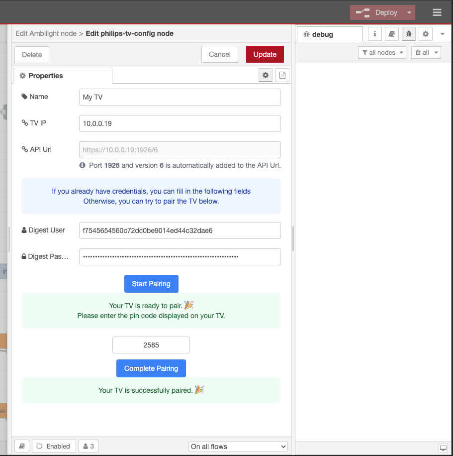

# node-red-contrib-js-philips-tv-control

[](https://www.npmjs.com/package/@keload/node-red-dxp)

[](https://www.npmjs.com/package/@keload/node-red-contrib-js-philips-tv-control)


A collection of nodes to control Philips TV with Node-RED, including Ambilight control.

Build on top of [philtv-js](https://github.com/clement-berard/philtv-js) (no python, only Javascript), this package provides a set of nodes to control your Philips TV with Node-RED.

## Installation

```bash
npm install @keload/node-red-contrib-js-philips-tv-control
```

or with the palette manager in Node-RED.

## Prerequisites

You need to have valid digest credentials to access your TV.

You can do this in the TV config node.



## Features

Many feature are missing, but the package is growing. Here is the list of the current features:

### `ambilight`

- Manage Ambilight brightness
- Manage Ambilight Follow Video Mode

### `send-key`

Send a key to the TV to control it. (Mute, Volume Up, Volume Down, Power, ...)

### `info`

- Get TV information System
- Get all Ambilight current information
- Get all TV structure

## Roadmap

- [ ] Improve nodes documentation
- [ ] Add more nodes to manage more features
- [ ] Improve package documentation (Vitepress...)

## Contributing

This package use [node-red-dxp](https://www.npmjs.com/package/@keload/node-red-dxp) to build the package.
A crazy fast and easy way to build Node-RED package.

Please feel free to contribute to this package by creating issues or pull requests.

## License

MIT
