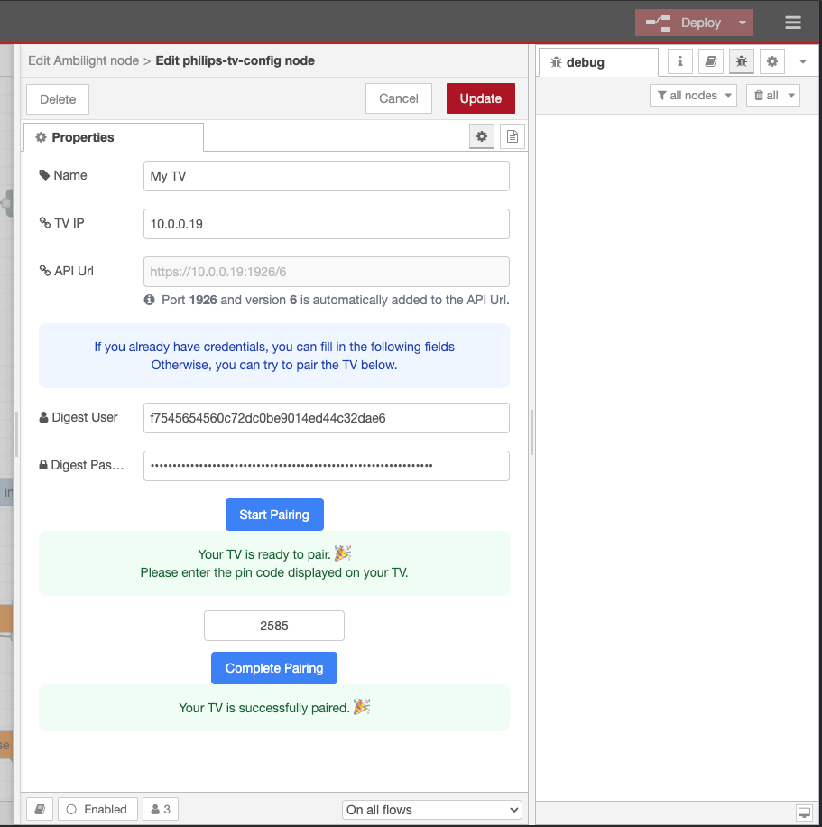

# node-red-contrib-js-philips-tv-control

Seamlessly integrate and control your Philips TV within your Node-RED flows. From remote key emulation to advanced Ambilight management, this package provides a lightweight, pure JavaScript solution to bring your TV into your smart home ecosystem.

Built on top of [philtv-js](https://github.com/clement-berard/philtv-js) (no Python dependency), this package provides a set of nodes to control your Philips TV with Node-RED.

<br/>
<p align="center">
  <a href="https://www.npmjs.com/package/@keload/node-red-dxp" aria-label="Build with node-red-dxp">
    
  </a>
</p>
<p align="center">
    <a href="https://github.com/clement-berard/node-red-contrib-js-philips-tv-control/graphs/contributors">
        
    </a>
    <a href="https://github.com/clement-berard/node-red-contrib-js-philips-tv-control/network/members">
        
    </a>
    <a href="https://github.com/clement-berard/node-red-contrib-js-philips-tv-control/stargazers">
        
    </a>
    <a href="https://github.com/clement-berard/node-red-contrib-js-philips-tv-control/issues">
        
    </a>
</p>
<p align="center">
  <a aria-label="NPM Version" href="https://www.npmjs.com/package/@keload/node-red-contrib-js-philips-tv-control">
    
  </a>
  <a aria-label="NPM Download Count" href="https://www.npmjs.com/package/@keload/node-red-contrib-js-philips-tv-control">
    
  </a>
</p>

## ✨ Features

- **📺 TV Control**: Emulate remote control keys directly from Node-RED (Power, Volume, Mute, Navigation, etc.).
- **💡 Ambilight Management**: Fine-tune your viewing experience by controlling Ambilight brightness and toggling between *Follow Video* and *Follow Audio* modes.
- **ℹ️ System Information**: Retrieve real-time detailed system status, current Ambilight configuration, and TV structure data.
- **🚀 Pure JavaScript**: No Python bindings or heavy dependencies. Perfect for Docker and lightweight environments.

## 📦 Installation

```bash
npm install @keload/node-red-contrib-js-philips-tv-control
```

or with the palette manager in Node-RED.

## ⚙️ Prerequisites

You need to have valid digest credentials to access your TV.
You can do this securely in the TV config node by entering the PIN displayed on your TV screen during pairing.

<p align="center">
    
</p>

## 🛠️ Available Nodes

### `send-key`
Send a key to the TV to control it. *(e.g., Mute, Volume Up, Volume Down, Power, ...)*

### `ambilight`
Take full control over your TV's built-in LED system.
- Manage Ambilight brightness
- Manage Ambilight Follow Video/Audio Mode

### `info`
Fetch real-time data from your TV to trigger conditional flows.
- Get TV information System
- Get all Ambilight current information
- Get all TV structure

## 🤝 Contributing

This package leverages [node-red-dxp](https://www.npmjs.com/package/@keload/node-red-dxp) under the hood—a crazy fast and easy way to structure and build Node-RED packages.

Please feel free to contribute to this package by creating issues or pull requests.

## 📄 License

MIT
